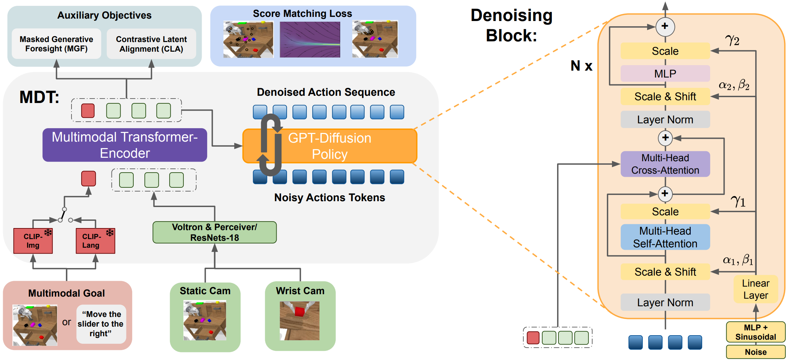
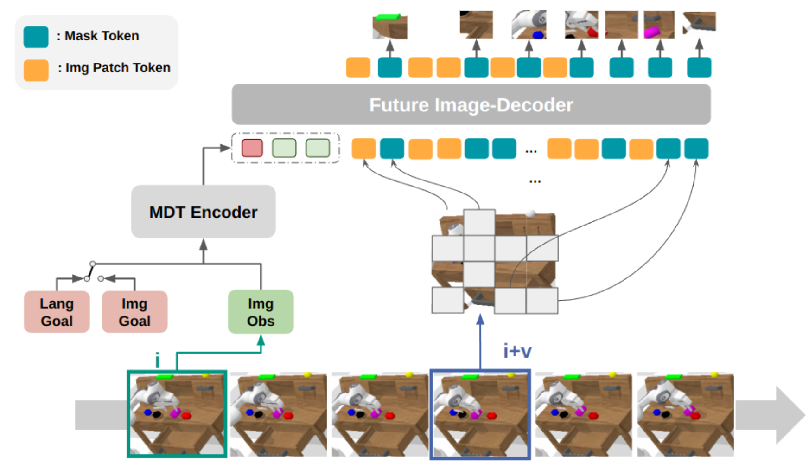
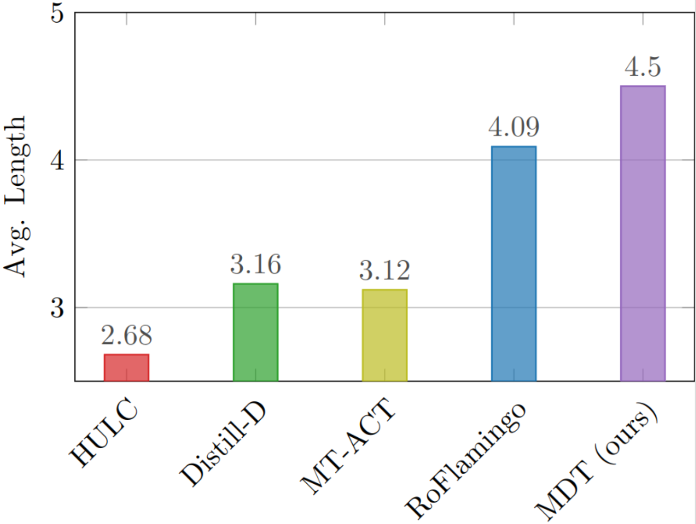

<!-- Using HTML to center the abstract -->
<video width="100%" autoplay controls muted loop playsinline>
    <source src="./static/videos/mdt-v5-encoded.mp4" type="video/mp4">
</video>

---

<div class="columns is-centered has-text-centered">
    <div class="column is-four-fifths">
        <h2>Abstract</h2>
        <div class="content has-text-justified">
This work introduces the Multimodal Diffusion
Transformer (MDT), a novel diffusion policy framework, that
excels at learning versatile behavior from multimodal goal specifi-
cations with few language annotations. MDT leverages a diffusion
based multimodal transformer backbone and two self-supervised
auxiliary objectives to master long-horizon manipulation tasks
based on multimodal goals. The vast majority of imitation
learning methods only learn from individual goal modalities,
e.g. either language or goal images. However, existing large-
scale imitation learning datasets are only partially labeled with
language annotations, which prohibits current methods from
learning language conditioned behavior from these datasets.
MDT addresses this challenge by introducing a latent goal-
conditioned state representation, that is simultaneously trained
on multimodal goal instructions. This state representation aligns
image and language based goal embeddings and encodes suffi-
cient information to predict future states. The representation is
trained via two self-supervised auxiliary objectives that enhance
the performance of the presented transformer backbone. MDT
shows exceptional performance on 164 tasks provided by the chal-
lenging CALVIN and LIBERO benchmarks, including a LIBERO
version that contains less than 2% language annotations. Further,
MDT establishes a new record on the CALVIN manipulation
challenge, demonstrating an absolute performance improvement
of 15% over prior state-of-the-art methods, that require large-
scale pretraining and contain 10× more learnable parameters.
MDT demonstrated its ability to solve long-horizon manipulation
from sparsely annotated data in both simulated and real-world
environments.
        </div>
    </div>
</div>

---

<!-- > Note: This is an example of a Jekyll-based project website template: [Github link](https://github.com/shunzh/project_website).\
> The following content is generated by ChatGPT. The figure is manually added. -->

## Model Architecture

**Left**: Overview of the proposed multimodal Transformer-Encoder-Decoder Diffusion Policy used in MDT.
**Right**: Specialized Diffusion Transformer Block for the Denoising of the Action Sequence.

MDT learns a goal-conditioned latent
state representation from multiple image observations and multimodal goals. The camera images are either processed with
frozen Voltron Encoders and a Perceiver or using ResNets. The separate GPT denoising module iteratively denoises an action
sequence of 10 steps with a Transformer Decoder with causal Attention. It consists of several Denoising Blocks, as visualized
on the right side. These blocks process noisy action tokens with self-attention and fuse the conditioning information from the
latent state representation via cross-attention. MDT applies adaLN conditioning to condition the blocks on the current
noise level. In addition, it aligns the latent representation tokens of the same state with different goal specifications using
self-supervised contrastive learning. The latent representation tokens are also used as a context input for the masked Image
Decoder module to reconstruct masked-out patches from future images.

<div class="columns">
    <div class="column is-half">
        <h3>Masked Generative Foresight</h3>
        <p>The Masked Generative Foresight Auxiliary Task
            enhances the MDT model. It starts by encoding the current
            observation and goal using the MDT Encoder. The resulting
            latent state representations then serve as conditional inputs
            for the Future Image-Decoder. This decoder receives encoded
            patches of future camera images along with mask tokens. Its
            task is to reconstruct the occluded patches in future frames.</p>
        </div>
    <div class="column is-half">
        
    </div>
</div>

## State-of-the-art on CALVIN ABCD→D
MDT-V sets a
new record in the CALVIN challenge, extending the average
rollout length to **4.51** which is a **10% absolute improvement**
over RoboFlamingo. MDT also surpasses all other tested
methods. Notably, MDT achieves this while having less than
10% of trainable parameters and not requiring pretraining
on large-scale datasets.

<div class="columns is-centered">
    <div class="column is-two-thirds">
        D"/>
    </div>
</div>
<div class="columns is-mobile is-multiline is-centered">
    <div class="column is-half-mobile is-one-third-tablet">
        <video width="100%" autoplay controls muted loop playsinline>
            <source src="./static/videos/mdt_02.mp4" type="video/mp4">
        </video>
    </div>
    <div class="column is-half-mobile is-one-third-tablet">
        <video width="100%" autoplay controls muted loop playsinline>
            <source src="./static/videos/5_seq_mdt_rollout_text_3.mp4" type="video/mp4">
        </video>
    </div>
    <div class="column is-half-mobile is-one-third-tablet">
        <video width="100%" autoplay controls muted loop playsinline>
            <source src="./static/videos/5-seq_mdt_rollout_text_4.mp4" type="video/mp4">
        </video>
    </div>
</div>

## Real Robot Experiments
Real world play dataset encompasses
around 4.5 hours of interactive **play data** with **20 different
tasks** for the policies to learn. Play demonstrations last
from around 30 seconds to more than 450 seconds and contain
between 5 and 20 tasks. The dataset is **partially labeled** by
randomly identifying some tasks in the demonstrations and
annotating the respective interval, yielding a total of 360 labels (~18 labels per task)
or approximately 20% of the dataset.

### Sample Demonstration from the Real Robot Dataset
<video width="100%" autoplay controls muted loop playsinline>
    <source src="./static/videos/demonstration.mp4" type="video/mp4">
</video>
### Evaluation Videos
#### Multi-task
<div class="columns is-centered is-mobile">
    <div class="column is-half">
        <video width="100%" autoplay controls muted loop playsinline>
            <source src="./static/videos/m1.mp4" type="video/mp4">
        </video>
    </div>
    <div class="column is-half">
        <video width="100%" autoplay controls muted loop playsinline>
            <source src="./static/videos/m2.mp4" type="video/mp4">
        </video>
    </div>    
</div>
#### Single-task
<div class="columns is-centered is-multiline is-mobile">
    <div class="column is-half-mobile is-one-quarter-tablet">
        <video width="100%" autoplay controls muted loop playsinline>
            <source src="./static/videos/s1.mp4" type="video/mp4">
        </video>
    </div>
    <div class="column is-half-mobile is-one-quarter-tablet">
        <video width="100%" autoplay controls muted loop playsinline>
            <source src="./static/videos/s2.mp4" type="video/mp4">
        </video>
    </div>
    <div class="column is-half-mobile is-one-quarter-tablet">
        <video width="100%" autoplay controls muted loop playsinline>
            <source src="./static/videos/s3.mp4" type="video/mp4">
        </video>
    </div>
    <div class="column is-half-mobile is-one-quarter-tablet">
        <video width="100%" autoplay controls muted loop playsinline>
            <source src="./static/videos/s4.mp4" type="video/mp4">
        </video>
    </div>
    <div class="column is-half-mobile is-one-quarter-tablet">
        <video width="100%" autoplay controls muted loop playsinline>
            <source src="./static/videos/s5.mp4" type="video/mp4">
        </video>
    </div>
    <div class="column is-half-mobile is-one-quarter-tablet">
        <video width="100%" autoplay controls muted loop playsinline>
            <source src="./static/videos/s6.mp4" type="video/mp4">
        </video>
    </div>
    <div class="column is-half-mobile is-one-quarter-tablet">
        <video width="100%" autoplay controls muted loop playsinline>
            <source src="./static/videos/s7.mp4" type="video/mp4">
        </video>
    </div>
    <div class="column is-half-mobile is-one-quarter-tablet">
        <video width="100%" autoplay controls muted loop playsinline>
            <source src="./static/videos/s8.mp4" type="video/mp4">
        </video>
    </div>
</div>

## Citation
```
@inproceedings{
    anonymous2024multimodal,
    title={Multimodal Diffusion Transformer: Learning Versatile Behavior from Multimodal Goals},
    author={Anonymous},
    booktitle={Robotics: Science and Systems},
    year={2024},
    url={https://openreview.net/forum?id=53hDWlCCKK}
}
```
